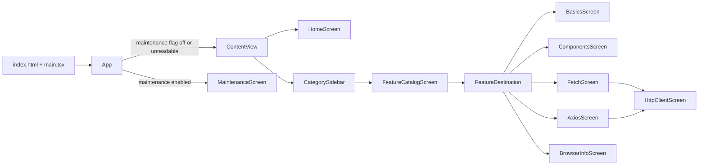
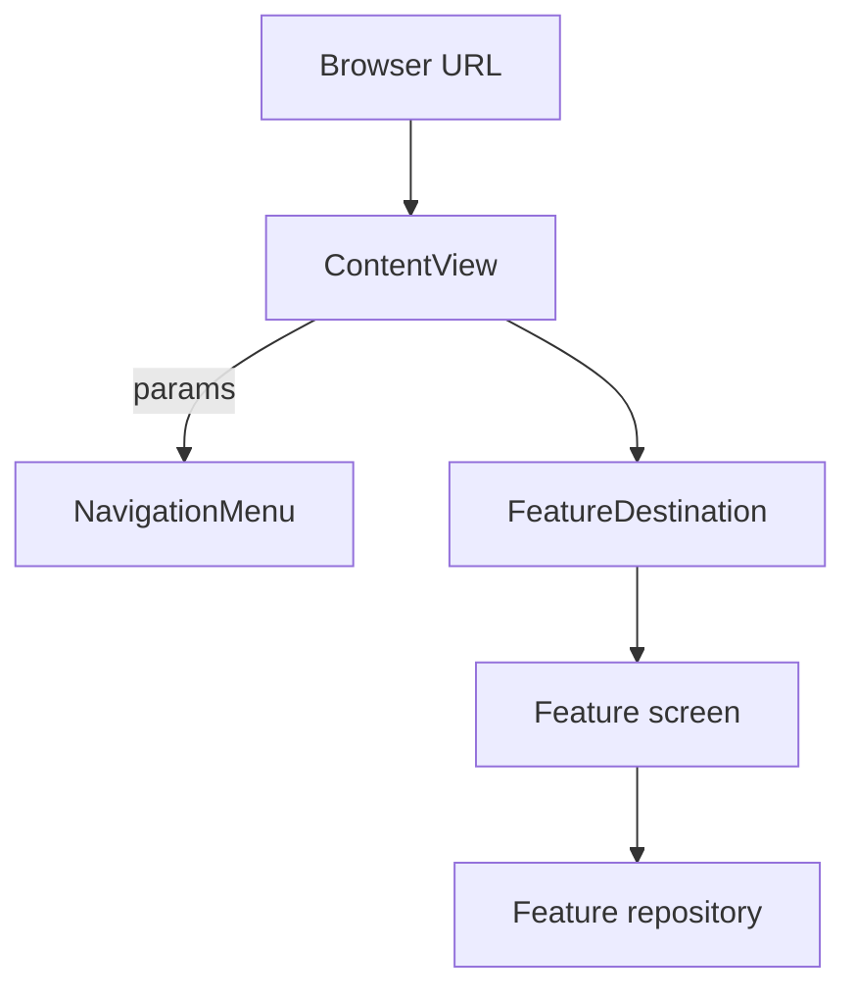

# Application architecture

Status: Implemented snapshot, 2026-10-04

## Purpose

GJPLab is a single-page web learning application. It favours small, readable feature slices over production-scale abstraction: React renders the interface, the URL is the navigation state, `ContentView` shows one, two, or three panes on touch screens and a tree sidebar beside the content on desktop browsers, components own small local state, and repositories isolate browser and network mechanics.

## Runtime flow



[`main.tsx`](../../src/main.tsx) mounts [`App`](../../src/app/App.tsx) inside a `BrowserRouter` whose `basename` is the deployment path (`/lab/react`) and loads the theme. Routes and links in the code are written without it. `App` reads the maintenance flag (showing only the background meanwhile), then [`ContentView`](../../src/app/ContentView.tsx) or the maintenance screen.

## Code organization

| Path | Responsibility |
| --- | --- |
| `src/app/` | `App` (startup phases), `ContentView` (routes and panes), and `FeatureDestination` (maps a `FeatureRoute` to its lazily loaded screen) |
| `src/app/home/` | `HomeScreen`, the home page at `/` |
| `src/app/startup/` | The maintenance screen and `fetchMaintenanceMode` |
| `src/app/navigation/` | `navigation.json` and its parser `NavigationMenu`; `FeatureRoute`; `paneLayout`, `useWindowWidth`, and `useFinePointer`; `NavigationPane`, `DesktopSidebar`, `NavigationTree`, `sidebarPreference`, `CategorySidebar`, `CategoryIcon`, and `FeatureCatalogScreen` |
| `src/features/<category>/<feature>/` | Feature screens, repositories, models, and their tests; a category may add `shared/` for code its features share (`httpclient/shared/`) |
| `src/common/config/` | Stable application behaviour constants (`AppConfig`) and `preferenceStorage` (safe local storage access for saved preferences) |
| `src/common/theme/` | Slate tokens (`theme.css`), `ColorSchemeToggle` and `useColorScheme`, `LabButton`, `LabTabs`, `LabListCard`, and `LabDemoPage` and `LabDemoSection` |
| `src/common/codesample/` | `CodeSample`, `runSample`, and the runnable sample page and card used by the TypeScript topics |

The layout and names mirror the iOS lab ([decision 0001](../decisions/0001-flat-feature-folders.md)). Folder names are lowercase and do not repeat their parent (`httpclient/fetch`). New code should follow the closest feature pattern; reusable app behaviour belongs in `common/`.

### Adding a feature

1. Write `doc/specs/features/<category>/<feature>/<feature>_requirement.md` from the [requirement template](../templates/requirement.md); add `<feature>_detail_design.md` beside it from the [detail design template](../templates/detail_design.md).
2. Add the screen under `src/features/<category>/<feature>/`. It draws only its content: the pane supplies the title and back link.
3. Add the route to `featureRoutes` in `src/app/navigation/FeatureRoute.ts` and its lazy screen in `FeatureDestination`.
4. In `src/app/navigation/navigation.json`, add the topic with `"route": "<route>"`, or give a planned topic the route. `NavigationMenu.test.ts` fails if a route is missing, listed twice, or misspelled.
5. Add tests next to the code: unit tests for logic, a Testing Library render test for the screen. Check the screen in a browser in light and dark mode and at phone width.

## Dependency and event flow



- The URL owns the selection: `/<category>/<route>`. Links in the sidebar and catalogue change it; `ContentView` reads it with `useParams`.
- A feature shows its results in place: the fetch page renders the response under its form. Deeper URLs open their topic ([decision 0007](../decisions/0007-inline-fetch-response.md)).
- Components own their presentation state with `useState`; repositories (`executeRequest`, `readBrowserInfo`) own network and browser access.

## State and lifecycle model

The project intentionally uses the URL and component state instead of a state library:

- The selected category and topic live in the URL, so they survive a reload and can be shared as a link.
- Pushed data (the HTTP response) lives in router state, which survives a reload in the same tab but not a copied link; without it, the URL falls back to the feature.
- Component state is reset when a screen leaves the page.

Do not introduce a state library, data-fetching library, or global context store as incidental refactoring. Add one only for a demonstrated requirement.

## Platform and security boundaries

The browser's same-origin policy applies to every request: the fetch topic can only read responses from servers that allow this site through CORS, and only the response headers the server exposes. `VITE_` environment variables are bundled into the page, so they must never hold secrets.

## Build and verification

| Setting | Value |
| --- | --- |
| Toolchain | Node.js 22.22+, npm, Vite 8, TypeScript 6 (strict) |
| UI | React 19, React Router 8, Tailwind CSS 4 |
| Tests | Vitest 5 with jsdom and Testing Library |
| Lint | oxlint (react, typescript, oxc plugins) |
| Deployment path | `/lab/react/`: `base` in `vite.config.ts` prefixes asset URLs, `BrowserRouter` uses it as `basename`, and `AppConfig` builds the maintenance flag URL from `import.meta.env.BASE_URL`. The server must answer unknown paths below it with `index.html` (see the README) |

```bash
npm run lint
npm test
npm run build
```

Then open `npm run dev` in a browser, check the console, and try phone, medium, and wide windows in light and dark mode.

## Known architectural constraints

| Constraint | Consequence | Revisit when |
| --- | --- | --- |
| One single-page app | Fast discovery; no server rendering | Search indexing or first-paint speed matters |
| Component-local state | Low ceremony; state resets when a screen closes | State must be shared across screens |
| Hand-built adaptive panes ([decision 0003](../decisions/0003-url-driven-adaptive-panes.md)) | Readable and dependency-free; no pane animations | Transitions or deeper push stacks are needed |
| Maintenance flag from a JSON file | No vendor SDK; a cached file can delay a change | A real remote-config service is integrated |
| Unit and component tests only | No end-to-end browser tests | Cross-browser behaviour becomes important to preserve |

Feature-specific behaviour belongs in the linked documents rather than this overview: [Slate design system](../specs/common/theme/theme_detail_design.md), [runnable code sample](../specs/common/codesample/codesample_detail_design.md), [maintenance](../specs/app/startup/maintenance_detail_design.md), [home page](../specs/app/home/home_detail_design.md), [sidebar and panes](../specs/app/navigation/sidebar_detail_design.md), [catalogue](../specs/app/navigation/catalog_detail_design.md), [Values & types](../specs/features/typescript/basics/basics_detail_design.md), [Null & undefined](../specs/features/typescript/nullish/nullish_detail_design.md), [Arrays, sets & maps](../specs/features/typescript/collections/collections_detail_design.md), [Functions & closures](../specs/features/typescript/functions/functions_detail_design.md), [Objects, classes & enums](../specs/features/typescript/classes/classes_detail_design.md), [Interfaces & generics](../specs/features/typescript/generics/generics_detail_design.md), [Error handling](../specs/features/typescript/errors/errors_detail_design.md), [Promises & async/await](../specs/features/typescript/promises/promises_detail_design.md), [Iterators & generators](../specs/features/typescript/iterators/iterators_detail_design.md), [Strings & regex](../specs/features/typescript/strings/strings_detail_design.md), [Components & props](../specs/features/react/components/components_detail_design.md), [State & events](../specs/features/react/state/state_detail_design.md), [Effects](../specs/features/react/effects/effects_detail_design.md), [Lists & keys](../specs/features/react/lists/lists_detail_design.md), [Forms](../specs/features/react/forms/forms_detail_design.md), [Context](../specs/features/react/context/context_detail_design.md), [Refs & the DOM](../specs/features/react/refs/refs_detail_design.md), [Suspense & lazy loading](../specs/features/react/suspense/suspense_detail_design.md), [Transitions & actions](../specs/features/react/transitions/transitions_detail_design.md), [Accessibility & testing](../specs/features/react/accessibility/accessibility_detail_design.md), [fetch](../specs/features/httpclient/fetch/fetch_detail_design.md), [axios](../specs/features/httpclient/axios/axios_detail_design.md), [HTTP client shared layout](../specs/features/httpclient/shared/shared_detail_design.md), and [Browser & device](../specs/features/others/browserinfo/browserinfo_detail_design.md).
