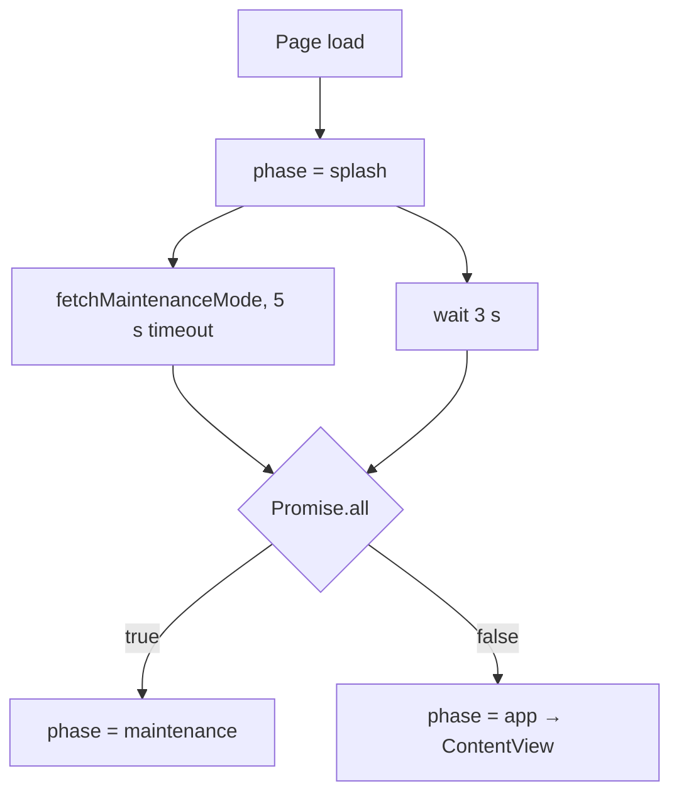

# Splash screen detailed design

Status: Implemented, with known gaps

Requirements: [Splash screen](splash_requirement.md)

## Implementation goal

`App` starts the maintenance check and a minimum timer together and waits for both with `Promise.all`, so the later one decides when the splash ends and the destination is chosen once.

## Source map

| Source | Responsibility |
| --- | --- |
| [`App.tsx`](../../../../src/app/App.tsx) | Startup phase (`splash`, `maintenance`, `app`), minimum timer, and destination |
| [`SplashScreen.tsx`](../../../../src/app/startup/SplashScreen.tsx) | Brand presentation only |
| [`maintenanceMode.ts`](../../../../src/app/startup/maintenanceMode.ts) | Fetches the flag with a timeout and fails open |
| [`AppConfig.ts`](../../../../src/common/config/AppConfig.ts) | 3-second minimum, 5-second timeout, and the flag URL |
| [`LabMark.tsx`](../../../../src/common/theme/LabMark.tsx) | The brand mark |

## Coordination model

The effect sets an `isCurrent` flag so a result that arrives after unmount (for example in React's development double-invoke) is ignored. `App` takes `minimumSplashMs` as a prop, so tests can skip the wait.

## Known gaps

| Gap | Effect | Suggested fix |
| --- | --- | --- |
| The splash shows on every reload | Developers wait 3 seconds after each full reload | Lower `minimumSplashMs` in development, or skip the splash when the flag was checked recently |
| No progress indicator | Only the mark and name are shown | Add an indeterminate progress bar with `role="progressbar"` |
| The check is not retried during the session | Turning maintenance on does not affect open tabs | Re-check on `visibilitychange` if that becomes a requirement |

## Verification

- Automated: `App.test.tsx` checks the splash, then the navigation when the flag is off, and maintenance then retry when it is on; `maintenanceMode.test.ts` covers on, off, HTTP error, bad JSON, network failure, and timeout.
- Manual: SPL-AC-01 to SPL-AC-05 in Chrome and Safari, with `public/remote-config.json` set to `true` and `false`, and with the network offline in developer tools.
