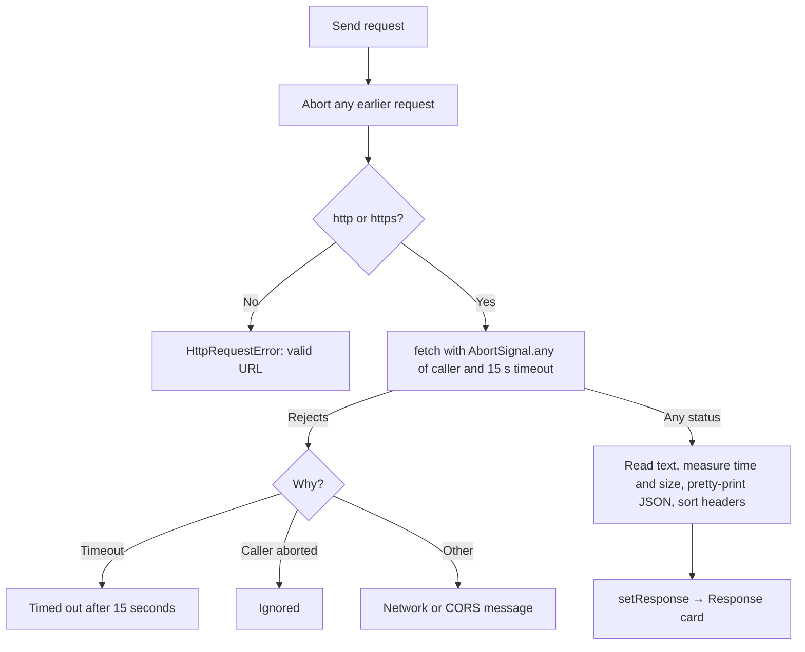

# fetch detailed design

Status: Implemented, with known gaps

Requirements: [fetch](fetch_requirement.md)

## Implementation goal

Show the smallest complete `fetch` round trip on one page: validate input, send with a timeout and cancellation, show the status, body, and headers under the form, and show the code, while keeping request mechanics out of the component.

## Source map

| Source | Responsibility |
| --- | --- |
| [`FetchScreen.tsx`](../../../../../src/features/httpclient/fetch/FetchScreen.tsx) | The `HttpClient` for fetch, passed to the shared layout; the implementation is imported with `?raw` |
| [`fetchRepository.ts`](../../../../../src/features/httpclient/fetch/fetchRepository.ts) | `executeRequest`: the 15-second timeout, cancellation, timing, and error messages around `fetch` |
| [`fetchSnippet.ts`](../../../../../src/features/httpclient/fetch/fetchSnippet.ts) | `buildFetchSnippet`: the `fetch` call for the form's request |
| [Shared layout](../shared/shared_detail_design.md) | The page, examples, response view, and request helpers shared with axios ([decision 0008](../../../../decisions/0008-shared-http-client-layout-and-axios.md)) |
| [`FeatureDestination.tsx`](../../../../../src/app/FeatureDestination.tsx) | Lazily loads the screen for `fetch` |

## Ownership and state

The page state (request input, chosen example API, loading, error, response, and the abort controller) is owned by `HttpClientScreen`; see the [shared layout](../shared/shared_detail_design.md#ownership-and-state).

## Request flow

## Privacy and security

- Nothing is logged. The default URL is JSONPlaceholder, a public test API that allows any origin through CORS; the lab sends no credentials.
- The code snippet is built as text and rendered inside `<code>` by React, so typed URLs and payloads are escaped, never run.
- The examples call seven public APIs that need no key and allow any origin through CORS. Every example was sent from a browser page on `localhost` while it was written (statuses checked: 200, 201, 204, 404, 405, 418). They send no personal data. restful-api.dev and Swagger Petstore keep what is written, so their examples use made-up content; Petstore is shared with everyone.
- `parseHttpUrl` rejects `javascript:` and other schemes, so the URL field cannot run script.

## Known gaps

| Gap | Effect | Suggested fix |
| --- | --- | --- |
| The default and the examples depend on third-party services | An example fails if its API is down, changes, or starts requiring a key | Choose another API; the form works with any URL. `exampleApis.test.ts` checks the shape, not the live services |
| restful-api.dev replace and delete need a pasted id | Sending them unchanged returns an error | Intended: shows how saved APIs assign ids |
| The snippet always uses `JSON.stringify` for JSON payloads | It differs slightly from `executeRequest`, which sends the typed text | Intended for readability; the caption names the difference |
| Payload that is not JSON is sent as typed | The hint warns, but sending is allowed (useful for testing servers) | Intended |
| Non-text bodies are shown as text | Binary responses appear garbled | Show the size and content type instead |

## Verification

- Automated: `fetchRepository.test.ts` (status and header handling, size and time, request headers and payload, network failure, no request for an invalid URL); `fetchSnippet.test.ts` (GET, JSON payload, plain and empty payloads); `FetchScreen.test.tsx` (sends with a stubbed `fetch` and shows the fetch code); the [shared layout](../shared/shared_detail_design.md#verification) tests; `ContentView.test.tsx` (an old `/response` URL opens the topic).
- Manual: FET-AC-01 to FET-AC-13 in Chrome and Safari, with the network offline in developer tools.
