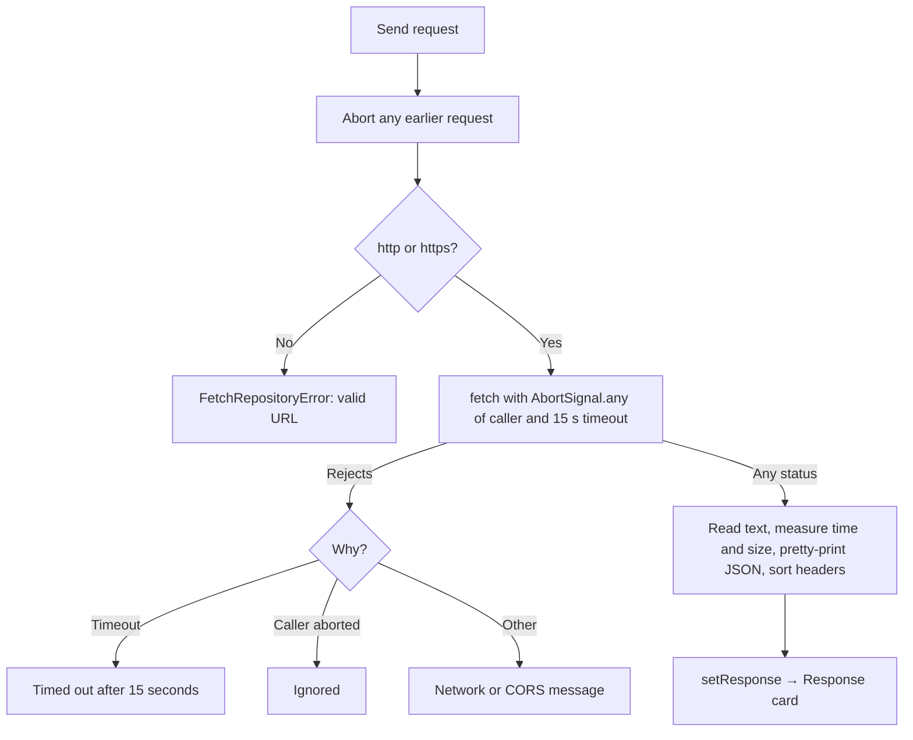

# fetch detailed design

Status: Implemented, with known gaps

Requirements: [fetch](fetch_requirement.md)

## Implementation goal

Show the smallest complete `fetch` round trip on one page: validate input, send with a timeout and cancellation, show the status, body, and headers under the form, and show the code, while keeping request mechanics out of the component.

## Source map

| Source | Responsibility |
| --- | --- |
| [`FetchScreen.tsx`](../../../../../src/features/httpclient/fetch/FetchScreen.tsx) | The Request, Response, and Code cards; form, response, loading and error state; cancellation on unmount; the implementation is imported with `?raw` |
| [`fetchRepository.ts`](../../../../../src/features/httpclient/fetch/fetchRepository.ts) | `parseHttpUrl`, `executeRequest` (headers, payload, 15-second timeout, timing, error messages), and `prettyJson` |
| [`exampleApis.ts`](../../../../../src/features/httpclient/fetch/exampleApis.ts) | `ExampleApi`, `RequestPreset`, and the examples for the seven APIs |
| [`HttpResponse.ts`](../../../../../src/features/httpclient/fetch/HttpResponse.ts) | `HttpMethod`, `supportsPayload`, `HttpResponse` (with `durationMs` and `sizeBytes`), `reasonPhrase`, and `formatBytes` |
| [`HttpResponseView.tsx`](../../../../../src/features/httpclient/fetch/HttpResponseView.tsx) | `StatusBadge`, `ResponseMeta` (time and size), and the Body and Headers tabs |
| [`jsonPayload.ts`](../../../../../src/features/httpclient/fetch/jsonPayload.ts) | `checkPayload`: empty, JSON (with a formatted copy), or other text |
| [`LabTabs.tsx`](../../../../../src/common/theme/LabTabs.tsx) | Shared accessible tabs |
| [`fetchSnippet.ts`](../../../../../src/features/httpclient/fetch/fetchSnippet.ts) | `buildFetchSnippet`: the `fetch` call for the form's request |
| [`FeatureDestination.tsx`](../../../../../src/app/FeatureDestination.tsx) | Lazily loads the screen for `fetch` |

## Ownership and state

| State | Owner | Lifetime | Meaning |
| --- | --- | --- | --- |
| `method`, `url`, `payload` | `FetchScreen` (`useState`) | Screen | Request input; an example overwrites the method and URL, and the payload only for `POST` and `PUT` |
| Chosen example API | `Examples` (`useState`) | Screen | Which API's examples are listed; starts at JSONPlaceholder |
| `isLoading`, `errorMessage` | `FetchScreen` (`useState`) | Screen | In flight; last failure |
| `controller` | `FetchScreen` (`useRef`) | Screen | Cancels the running request on a new send or unmount |
| `response` | `FetchScreen` (`useState`) | Screen | The last completed response; cleared when a request fails |

## Request flow

## Privacy and security

- Nothing is logged. The default URL is JSONPlaceholder, a public test API that allows any origin through CORS; the lab sends no credentials.
- The code snippet is built as text and rendered inside `<code>` by React, so typed URLs and payloads are escaped, never run.
- The examples call seven public APIs that need no key and allow any origin through CORS. Every example was sent from a browser page on `localhost` while it was written (statuses checked: 200, 201, 204, 404, 405, 418). They send no personal data. restful-api.dev and Swagger Petstore keep what is written, so their examples use made-up content; Petstore is shared with everyone.
- `parseHttpUrl` rejects `javascript:` and other schemes, so the URL field cannot run script.

## Known gaps

| Gap | Effect | Suggested fix |
| --- | --- | --- |
| The default and the examples depend on third-party services | An example fails if its API is down, changes, or starts requiring a key | Choose another API; the form works with any URL. `exampleApis.test.ts` checks the shape, not the live services |
| restful-api.dev replace and delete need a pasted id | Sending them unchanged returns an error | Intended: shows how saved APIs assign ids |
| The snippet always uses `JSON.stringify` for JSON payloads | It differs slightly from `executeRequest`, which sends the typed text | Intended for readability; the caption names the difference |
| Payload that is not JSON is sent as typed | The hint warns, but sending is allowed (useful for testing servers) | Intended |
| Non-text bodies are shown as text | Binary responses appear garbled | Show the size and content type instead |

## Verification

- Automated: `FetchScreen.test.tsx` (JSONPlaceholder default, examples and the snippet follow the form, switching the example API, the JSON hint and Format, status badge with time and size and the Body and Headers tabs through a stubbed `fetch`, a failure replaces the response, the implementation tab); `HttpResponse.test.ts` (reason phrases, sizes); `jsonPayload.test.ts`; `LabTabs.test.tsx`; `fetchSnippet.test.ts` (GET, JSON payload, plain and empty payloads); `exampleApis.test.ts` (seven APIs in order, https URLs on each API's host, payload only for `POST` and `PUT`, every method except for read-only PokeAPI, the id placeholder explained); `fetchRepository.test.ts` (URL validation, JSON formatting, status and header handling, request headers and payload, network failure, no request for an invalid URL); `ContentView.test.tsx` (an old `/response` URL opens the topic).
- Manual: FET-AC-01 to FET-AC-13 in Chrome and Safari, with the network offline in developer tools.
