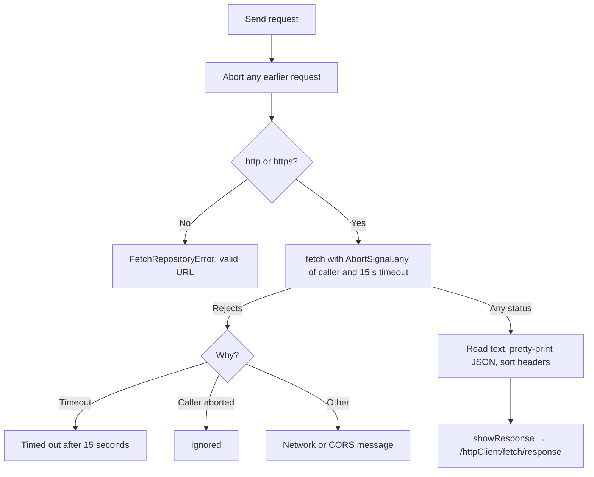

# fetch detailed design

Status: Implemented, with known gaps

Requirements: [fetch](fetch_requirement.md)

## Implementation goal

Show the smallest complete `fetch` round trip: validate input, send with a timeout and cancellation, and push the status, body, and headers as a new URL, while keeping request mechanics out of the component.

## Source map

| Source | Responsibility |
| --- | --- |
| [`FetchScreen.tsx`](../../../../../src/features/httpclient/fetch/FetchScreen.tsx) | Form, loading and error state, cancellation on unmount |
| [`fetchRepository.ts`](../../../../../src/features/httpclient/fetch/fetchRepository.ts) | `parseHttpUrl`, `executeRequest` (headers, payload, 15-second timeout, error messages), and `prettyJson` |
| [`HttpResponse.ts`](../../../../../src/features/httpclient/fetch/HttpResponse.ts) | `HttpMethod`, `supportsPayload`, and `HttpResponse` |
| [`HttpResponseScreen.tsx`](../../../../../src/features/httpclient/fetch/HttpResponseScreen.tsx) | Status, body, and headers |
| [`FeatureDestination.tsx`](../../../../../src/app/FeatureDestination.tsx) and [`ContentView.tsx`](../../../../../src/app/ContentView.tsx) | `FeatureNavigation.showResponse` and the `/response` pane |

## Ownership and state

| State | Owner | Lifetime | Meaning |
| --- | --- | --- | --- |
| `method`, `url`, `payload` | `FetchScreen` (`useState`) | Screen | Request input |
| `isLoading`, `errorMessage` | `FetchScreen` (`useState`) | Screen | In flight; last failure |
| `controller` | `FetchScreen` (`useRef`) | Screen | Cancels the running request on a new send or unmount |
| `HttpResponse` | Router state at `/response` | Tab history entry | The completed response |

## Request flow

## Privacy and security

- Nothing is logged. The default URL is the author's public API, which allows `http://localhost:5173` through CORS; the lab sends no credentials.
- `parseHttpUrl` rejects `javascript:` and other schemes, so the URL field cannot run script.

## Known gaps

| Gap | Effect | Suggested fix |
| --- | --- | --- |
| A deployed site needs CORS from the API | The default URL fails from any origin the server does not allow | Configure the server, or default to a CORS-open API |
| Payload is not validated as JSON | Invalid JSON is sent as-is | Validate before sending |
| No render test for the screen | The form is checked only manually | Add a Testing Library test with a stubbed `fetch` |
| Non-text bodies are shown as text | Binary responses appear garbled | Show the size and content type instead |

## Verification

- Automated: `fetchRepository.test.ts` (URL validation, JSON formatting, status and header handling, request headers and payload, network failure, no request for an invalid URL); `ContentView.test.tsx` (a `/response` URL without data falls back to the form).
- Manual: FET-AC-01 to FET-AC-06 in Chrome and Safari, with the network offline in developer tools.
