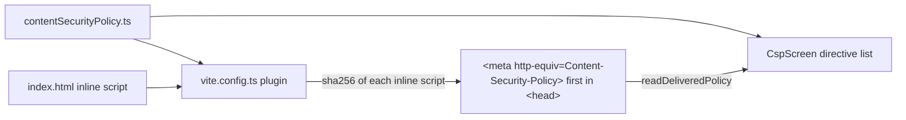

# Content Security Policy detailed design

Status: Implemented, with known gaps

Requirements: [Content Security Policy](csp_requirement.md)

## Implementation goal

Define the site policy once, enforce it in the production build, and build the topic around the same definition: the screen lists its directives, reads the policy the page was actually delivered with, and runs small attempts that the policy blocks. A pure checker teaches what makes a policy weak.

## Source map

| Source | Responsibility |
| --- | --- |
| [`contentSecurityPolicy.ts`](../../../../../src/common/config/contentSecurityPolicy.ts) | `sitePolicy` (directives, sources, and an explanation each), `serializePolicy`, and `inlineScripts` |
| [`vite.config.ts`](../../../../../vite.config.ts) | The build-only `contentSecurityPolicy()` plugin: hashes inline scripts with `node:crypto` and prepends the `<meta>` element |
| [`CspScreen.tsx`](../../../../../src/features/security/csp/CspScreen.tsx) | Screen, attempt results, violation log, and `PolicyCheck` |
| [`cspRepository.ts`](../../../../../src/features/security/csp/cspRepository.ts) | `readDeliveredPolicy`, `watchViolations`, and `browserProbes` (the three attempts) |
| [`policyReview.ts`](../../../../../src/features/security/csp/policyReview.ts) | `parsePolicy` and `reviewPolicy` |
| [`FeatureRoute.ts`](../../../../../src/app/navigation/FeatureRoute.ts), [`FeatureDestination.tsx`](../../../../../src/app/FeatureDestination.tsx), [`navigation.json`](../../../../../src/app/navigation/navigation.json) | Route `csp`, its lazy screen, and the catalogue entry |

## Delivering the policy

- The plugin uses `transformIndexHtml` with `order: 'post'` and `apply: 'build'`, so it sees the final HTML and never runs in the dev server. `inlineScripts` finds `<script>` elements without `src`; their text is hashed exactly as written, which is what the browser hashes.
- `injectTo: 'head-prepend'` puts the policy before the inline script, because a `<meta>` policy only covers what follows it. The charset declaration still falls within the first 1,024 bytes.
- `contentSecurityPolicy.ts` is compiled by both `tsconfig.app.json` and `tsconfig.node.json` (through the config's import), so it uses no DOM types and no `@/` alias.

## Ownership and state

The screen is reached at `/security/csp`. State is `useState` in `CspScreen` and `PolicyCheck`:

| State | Owner | Notes |
| --- | --- | --- |
| `delivered` | `CspScreen` | Read once with `readDeliveredPolicy()`; a page's policy cannot change after it loads |
| `results` | `CspScreen` | One `ProbeResult` per attempt |
| `violations` | `CspScreen` | Appended by `watchViolations` (subscribed in an effect, removed in cleanup); last six kept |
| `policy` | `PolicyCheck` | The checker text; `reviewPolicy(policy)` is calculated while rendering |

The screen takes one optional prop, `probes`, which tests set to fakes.

## The attempts

| Attempt | How | Blocked by | How the result is known |
| --- | --- | --- | --- |
| Inline script | Append a `<script>` whose text sets `data-csp-probe` on `<html>`, then remove it | `script-src` (reported as `script-src-elem`) | An allowed inline script runs during `append`, so the attribute is set at once or never |
| `new Function()` | Build and call `return 1 + 1` | `script-src` without `'unsafe-eval'` (reported as `script-src`, blocked `eval`) | It throws an `EvalError` |
| Inline `<style>` | Append a `<style>` that sets a custom property on a probe element | `style-src` (reported as `style-src-elem`) | `getComputedStyle` shows whether the rule applied |

Each attempt removes what it added. The browser fires `securitypolicyviolation` after a short delay, so the violation log may update just after the result.

## The checker

`parsePolicy` splits on `;`, lower-cases directive names, and keeps the first of any repeated directive, as browsers do. `reviewPolicy` uses script-src, or default-src when script-src is missing, and reports:

| Severity | Finding |
| --- | --- |
| High | Empty policy; no script rule; `'unsafe-inline'` without a hash or nonce; `*`, `https:`, `data:`, or plain `http:` script sources |
| Medium | `'unsafe-eval'`; plain http in other directives; object-src not `'none'`; no base-uri (it does not fall back to default-src) |
| Note | `'unsafe-inline'` ignored because of a hash or nonce; `'strict-dynamic'`; header-only or unknown directives; no weaknesses found |

It is a teaching aid, not a full audit: it does not look at script-src-elem, style rules, or host lists.

## Known gaps

| Gap | Effect | Suggested fix |
| --- | --- | --- |
| No policy in the dev server | Problems appear only in the production build | Check with `npm run preview`; a CSP-only dev mode would need Vite's nonce support and a server |
| `frame-ancestors` cannot be set in `<meta>` | Other sites can frame the lab unless the server sends a header | Add `Content-Security-Policy: frame-ancestors 'none'` in the server configuration |
| No violation reporting endpoint | Blocked attempts on real visits go unnoticed | Send the policy as a header with `report-to` and a collector |
| `connect-src https:` is broad | Allowed code could send data to any HTTPS host | Intended, for the HTTP Client topics |

## Verification

- Automated: `contentSecurityPolicy.test.ts` (serializing, no unsafe keywords or header-only directives, finding the inline script in index.html); `policyReview.test.ts` (parsing, each finding, ordering); `cspRepository.test.ts` (delivered policy, violation events, `new Function` runs without a policy); `CspScreen.test.tsx` (not in force, delivered text, attempts and violation log, checker and reset).
- Manual: CSP-AC-01 in `npm run dev`; CSP-AC-02 to CSP-AC-07 in `npm run preview` in Chrome, Safari, and Firefox, with the console open.
