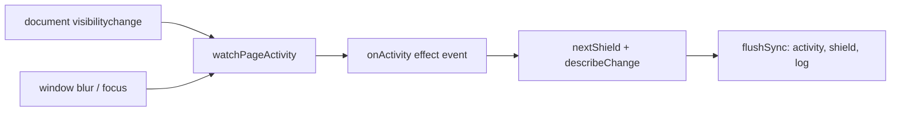

# Hide content when the page is hidden detailed design

Status: Implemented, with known gaps

Requirements: [Hide content when the page is hidden](hidecontent_requirement.md)

## Implementation goal

One `LabDemoPage` whose screen holds the settings, page activity, and shield state. A repository is the only code that touches `document` and `window`; the hiding decision and the saved settings are pure functions. When the page reports a change, the screen commits the placeholder synchronously with `flushSync`, so the sample values leave the page inside the browser event.

## Source map

| Source | Responsibility |
| --- | --- |
| [`HideContentScreen.tsx`](../../../../../src/features/security/hidecontent/HideContentScreen.tsx) | Screen state, the page-activity subscription, and the four cards (`AccountCard`, `HiddenCard`, `SettingCheckbox`, `ActivityLog`) |
| [`pageActivityRepository.ts`](../../../../../src/features/security/hidecontent/pageActivityRepository.ts) | `readPageActivity` and `watchPageActivity`, taking a `PageEnvironment` (the real `document` and `window` by default) |
| [`contentShield.ts`](../../../../../src/features/security/hidecontent/contentShield.ts) | `hideReasonFor`, `nextShield`, `describeChange`, and the placeholder text for each `HideReason` |
| [`hideContentSettings.ts`](../../../../../src/features/security/hidecontent/hideContentSettings.ts) | `HideContentSettings`, its defaults, and reading and writing them through `PreferenceStorage` |
| [`FeatureRoute.ts`](../../../../../src/app/navigation/FeatureRoute.ts), [`FeatureDestination.tsx`](../../../../../src/app/FeatureDestination.tsx), [`navigation.json`](../../../../../src/app/navigation/navigation.json) | Route `hideContent`, its lazily loaded screen, and the Security catalogue entry |

## Ownership and state

The screen is reached at `/security/hideContent`. All state is `useState` in `HideContentScreen` and lives as long as the screen is shown.

| State | Initial value | Changed by |
| --- | --- | --- |
| `settings` | `readHideContentSettings(browserStorage())` | The checkboxes, which also write the settings back |
| `activity` | `readPageActivity()` | Page activity events |
| `shield` (`HideReason \| undefined`) | `nextShield(undefined, activity, settings)`, so a page opened while hidden starts hidden | Page activity events, **Hide now**, **Show content** |
| `log` | Empty; the last six entries are kept | Each event and each button |

The screen takes two optional props, `environment` and `storage`, that only tests set.

## Page activity flow

- `watchPageActivity` is subscribed in a `useEffect` keyed on `environment` and returns its cleanup. The listener calls an effect event (`useEffectEvent`), which reads the latest `shield` and `settings`, so a settings change does not remove and add the listeners again.
- `blur` and `focus` are window events. Element focus events do not bubble, so a listener on the window hears only the window itself. The activity passed on takes focus from the event, rather than from `document.hasFocus()`, which can lag behind it.
- `flushSync` makes React update the page before the event handler returns. Without it, React would apply the update in a later task, after the browser has finished handling the event, giving it more time to take its snapshot first.

## Hiding decision

`hideReasonFor` returns `hidden` when **Hide when the page is hidden** is on and the page is hidden, then `unfocused` when **Also hide when the window loses focus** is on and the window has no focus. `nextShield` applies it:

| Current shield | Page calls for hiding | Result |
| --- | --- | --- |
| None | Yes | That reason |
| `unfocused` or `hidden` | Yes | The stronger reason (`manual` > `hidden` > `unfocused`), so switching tabs reads "went into the background" rather than "lost focus" |
| `unfocused` or `hidden` | No | None, or unchanged when **Keep hidden until I choose to show it** is on |
| `manual` | Either | `manual`; only **Show content** lifts it |

Settings changes do not call `nextShield`: they apply from the next event (the person is using the page when they change one, so nothing would be hidden anyway).

## Privacy and security

- While shielded, `HiddenCard` replaces `AccountCard`, so the sample values are not in the DOM: not readable by screen readers, find in page, copy, or the element inspector.
- The status message (`role="status"`) says only "Sample content shown." or "Sample content hidden."; it never repeats the values.
- Only the three booleans are saved, as JSON under `gjpLab.hideContent`. `readHideContentSettings` parses the text as `unknown` and keeps only boolean fields, so a damaged or edited value falls back to the defaults.
- The sample values are made up: a published test card number, a balance, and a code. Nothing is logged to the console or sent anywhere.

## Known gaps

| Gap | Effect | Suggested fix |
| --- | --- | --- |
| Snapshot timing is up to the browser | The tab overview or app switcher image may still show the values | None for a web page; documented as a platform limitation |
| Crossing a layout breakpoint remounts the screen | After a resize across 840 or 1200 px, a shield kept by **Keep hidden until I choose to show it** or **Hide now** is lifted; settings are kept | Accepted: the shield protects against glances, not against the person using the page, who can always select **Show content** |
| Only this topic's sample is protected | Other screens never hide | Intended (out of scope); an app-wide shield would belong in `App` |
| No end-to-end test with real tab switching | Tests fire the events on a fake page | Manual checks below |

## Verification

- Build with the project build command in [application architecture](../../../../architecture/application.md#build-and-verification).
- Automated: `pageActivityRepository.test.ts` (reading state, hidden and visible, focus taken from the event, cleanup); `contentShield.test.ts` (reasons, automatic and kept shields, manual shield, stronger reason, log text); `hideContentSettings.test.ts` (defaults, round trip, per-field fallback, blocked storage); `HideContentScreen.test.tsx` (hide and show on visibility, keep until shown and saving, focus loss setting, **Hide now** keeping focus on the button, starting from saved settings); `ContentView.test.tsx` and `HomeScreen.test.tsx` (the topic is listed as available).
- Manual: HID-AC-01 to HID-AC-08 in Chrome, Safari, and Firefox on a desktop, and in Safari on iOS and Chrome on Android, in light and dark mode at phone and desktop widths.
